# aws-ec2-static-portfolio-deployment
Production deployment of a secure static portfolio website on AWS EC2 using Nginx, Elastic IP, custom domain DNS routing, HTTPS with Let's Encrypt, SSH hardening and infrastructure monitoring with Datadog.

# LoveDigitals Portfolio Deployment on AWS

## Project Overview

This project documents the end-to-end deployment of my personal static portfolio website on an AWS EC2 Ubuntu Linux server.  
The goal of this project was not only to host a website but to gain practical experience in Linux server administration, cloud networking, domain configuration, web server setup, and production security implementation.

The deployment process involved creating a secure server environment, configuring SSH access, installing and configuring the Nginx web server, integrating a custom domain name, allocating a persistent public IP address, and implementing HTTPS encryption using Let's Encrypt.

---

## Architecture Diagram

The diagram below illustrates the end-to-end cloud architecture of the LoveDigitals portfolio deployment.

It shows how user HTTPS requests flow through the internet to the AWS infrastructure, how DNS resolves the domain to the Elastic IP, how Nginx serves the static website, and how Datadog provides infrastructure monitoring and observability.

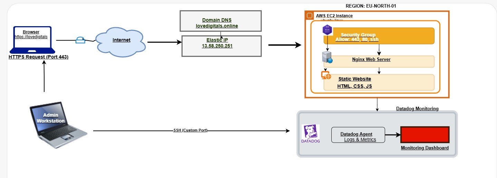

---

## Table of Contents

- [Server Provisioning and Initial Access](#server-provisioning-and-initial-access)
- [SSH Security Hardening](#ssh-security-hardening)
- [Nginx Web Server Installation](#nginx-web-server-installation)
- [Website Directory Creation and Deployment](#website-directory-creation-and-deployment)
- [Elastic IP Allocation and Association](#elastic-ip-allocation-and-association)
- [Domain Name Integration and DNS Configuration](#domain-name-integration-and-dns-configuration)
- [Nginx Server Block Configuration](#nginx-server-block-configuration)
- [HTTPS Security Implementation with Certbot](#https-security-implementation-with-certbot)
- [Project Outcome](#project-outcome)
- [Key Lessons Learned](#key-lessons-learned)
- [Future Improvements](#future-improvements)

---

## Server Provisioning and Initial Access

I began by launching an Ubuntu EC2 instance on AWS.  
After generating and downloading a private key file, I connected to the server using SSH from my local machine.

Once connected, I updated the server packages to ensure the system had the latest security patches and stable software versions.

sudo apt update  
sudo apt upgrade

This step was important to prevent compatibility issues and to reduce potential vulnerabilities.

### Deployment Evidence

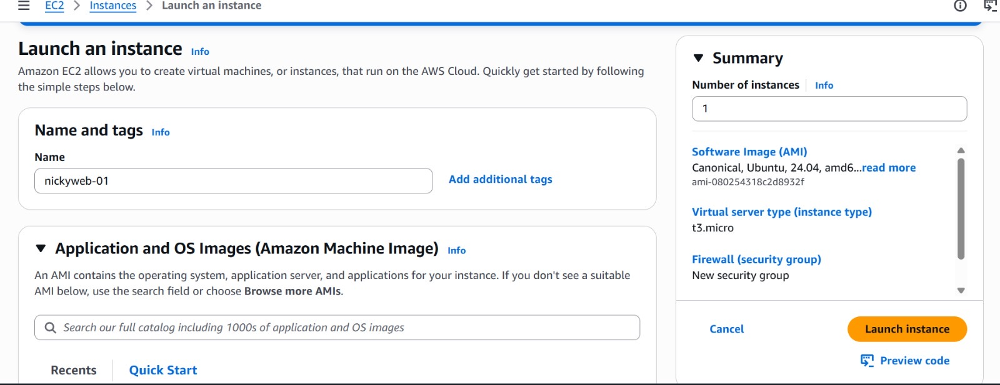
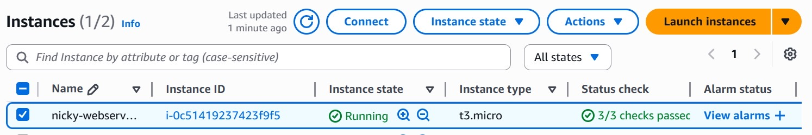
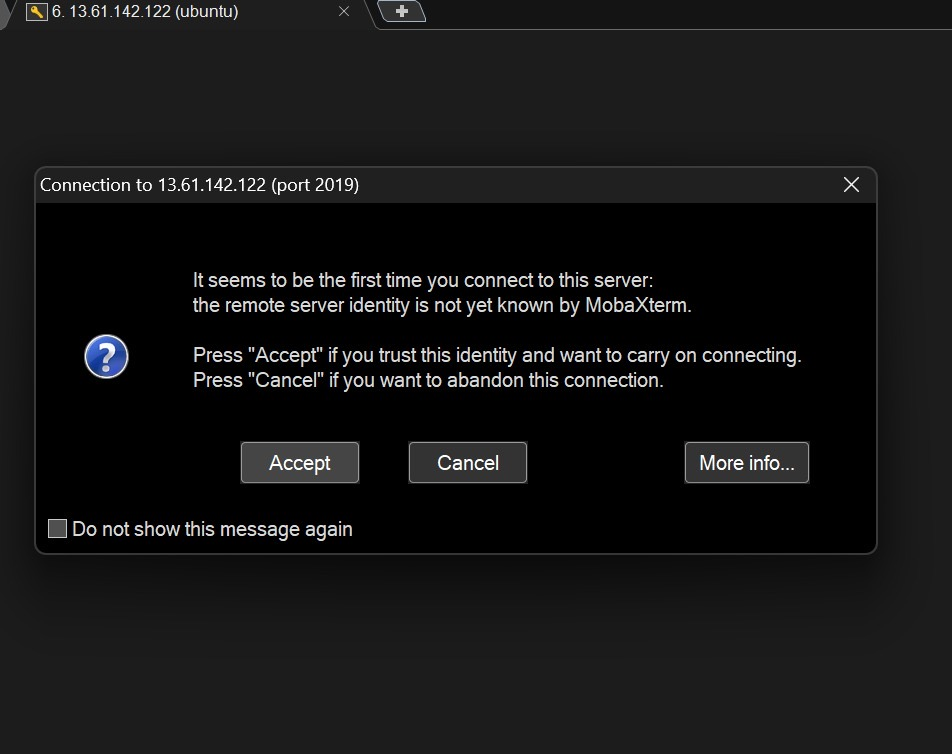
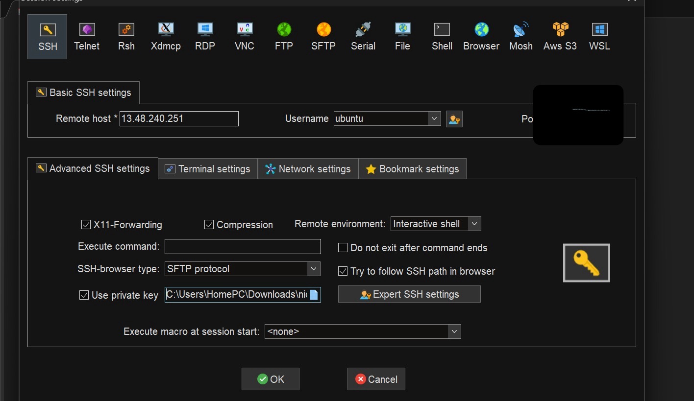

---

## SSH Security Hardening

To improve server security, I modified the default SSH configuration.  
Since port 22 is commonly targeted by automated bots and brute-force attacks, I changed the SSH listening port to a custom port.

After updating the SSH configuration file, I also updated the AWS security group inbound rules to allow traffic through the new port.  
The SSH service was then restarted to apply the changes.

This helped reduce the attack surface and improved overall server security.

### Deployment Evidence

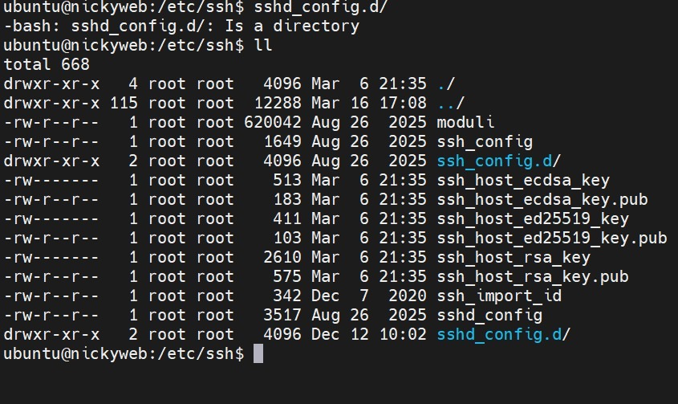
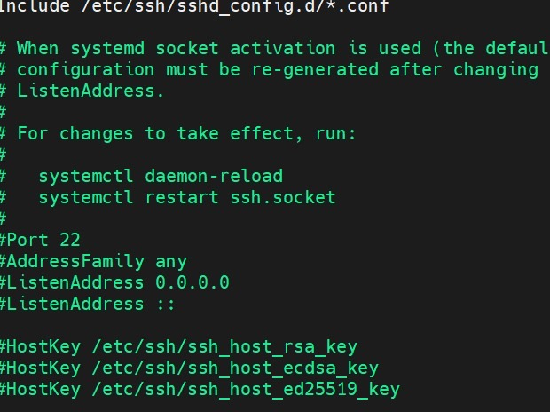
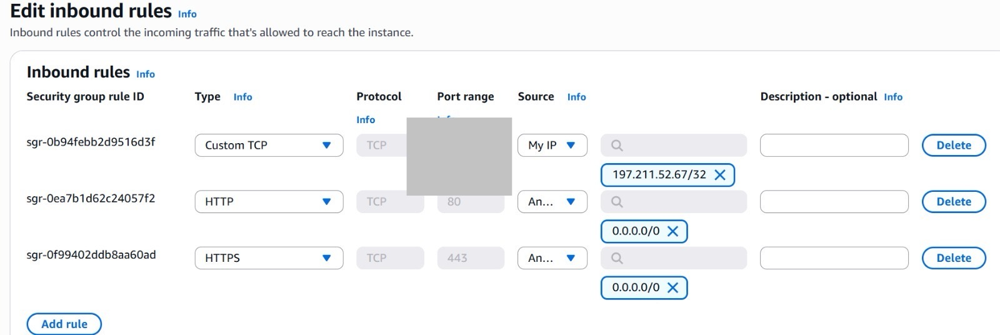

---

## Nginx Web Server Installation

After securing SSH access, I installed the Nginx web server to serve my static website files.

sudo apt install nginx -y

I confirmed that the Nginx service was running and accessible via the server’s public IP address.  
Seeing the default Nginx welcome page confirmed that the web server installation was successful.

### Deployment Evidence

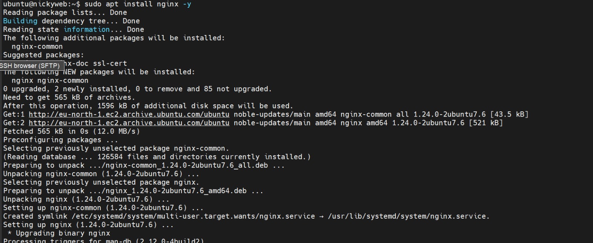
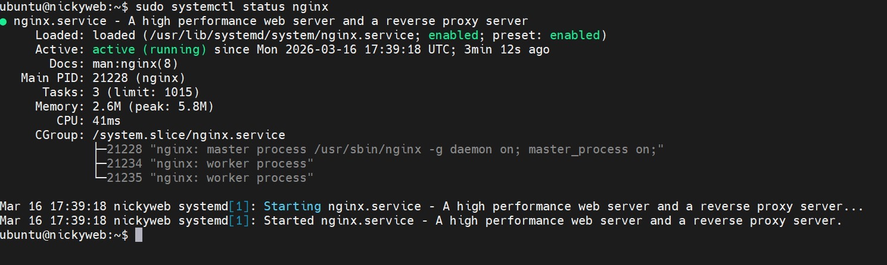

---

## Website Directory Creation and Deployment

To host my website, I created a new web root directory inside `/var/www`.

sudo mkdir /var/www/lovedigitals

I then changed the ownership of the directory to allow my user account to manage website files.

sudo chown -R ubuntu:ubuntu /var/www/lovedigitals

After this, I uploaded my static website files, including HTML, CSS, JavaScript, images, and other assets into the directory.

### Deployment Evidence

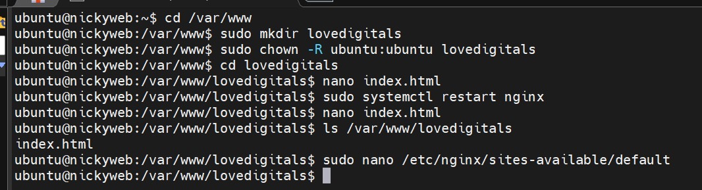
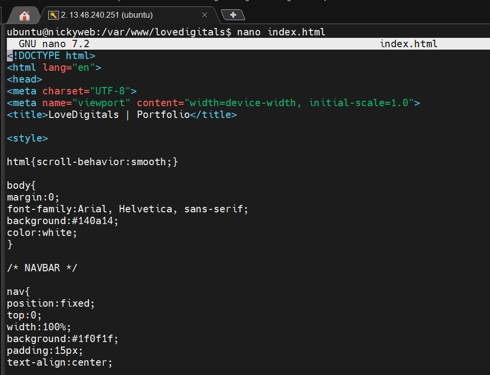

---

## Elastic IP Allocation and Association

Initially, the EC2 instance was using a dynamic public IP address.  
To ensure my website would remain accessible even after server restarts, I allocated an Elastic IP address from the AWS console.

After allocating the Elastic IP, I associated it with my EC2 instance.  
This provided a permanent public IP address that could be safely used for domain DNS configuration.

### Deployment Evidence

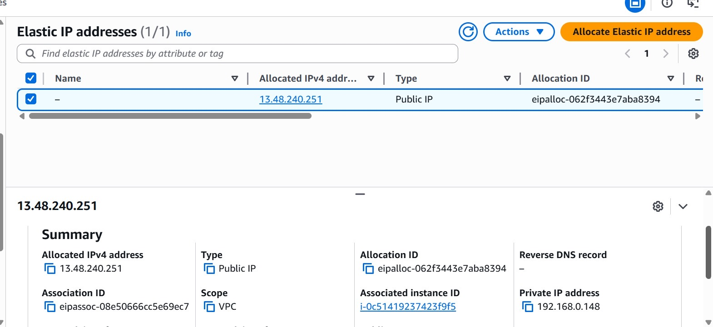
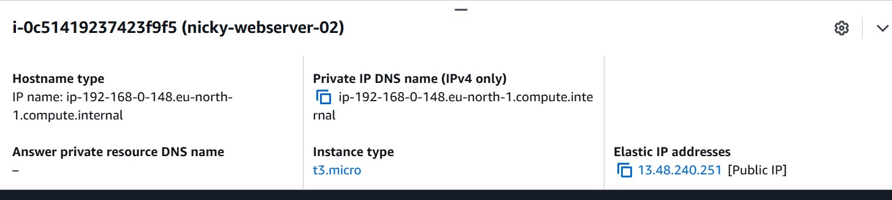

---

## Domain Name Integration and DNS Configuration

After purchasing a custom domain name, I configured DNS records from the domain provider dashboard.

I created A records for both the root domain and the www subdomain, pointing them to the Elastic IP address of my server.

This allowed users to access my website using a human-readable domain name instead of an IP address.

I also removed conflicting redirect records to ensure proper DNS resolution.

---

## Nginx Server Block Configuration

To make Nginx serve my website when the domain name was accessed, I edited the default Nginx configuration file and added my domain name to the server_name directive.

After saving the configuration changes, I tested the Nginx syntax and restarted the service to apply the new settings.

This ensured that requests to my domain were correctly routed to my website files.

### Deployment Evidence

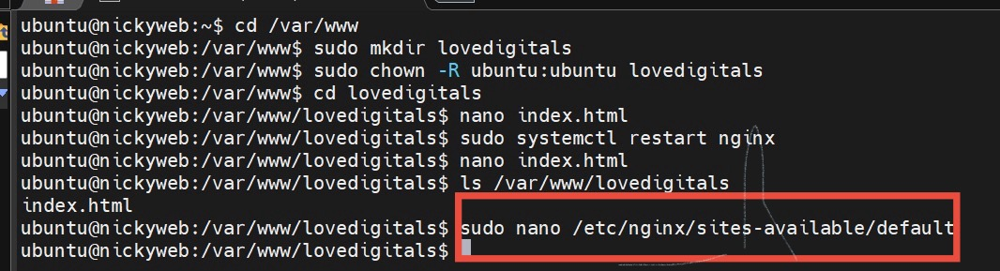
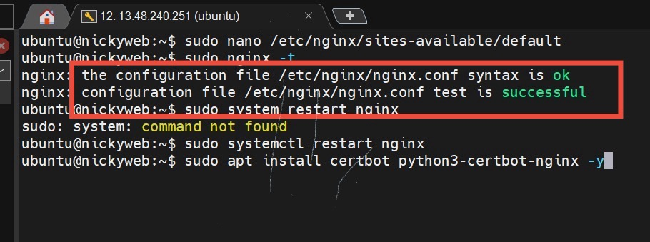

---

## HTTPS Security Implementation with Certbot

To secure user communication and improve trust, I installed Certbot and used it to obtain an SSL certificate from Let’s Encrypt.

Certbot automatically configured Nginx to support HTTPS and set up automatic redirection from HTTP to HTTPS.

I also verified that the certificate auto-renewal service was active to prevent future certificate expiration.

This step ensured encrypted communication between users and the server.

### Deployment Evidence

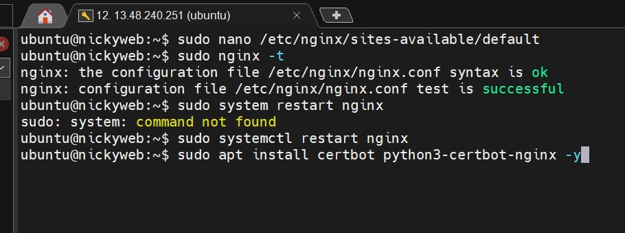
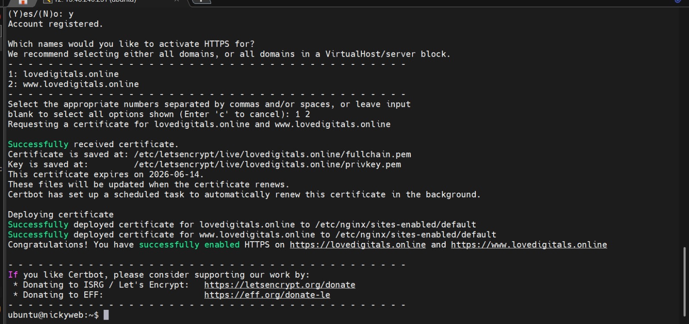
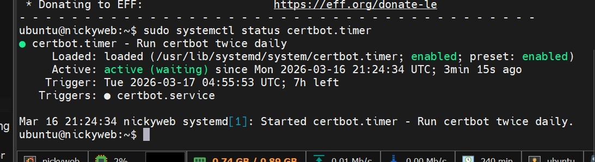

---

## Infrastructure Monitoring with Datadog

To ensure real-time visibility into server performance and application health, I integrated Datadog monitoring into the AWS EC2 environment.

This enabled system-level observability including CPU utilization, memory usage, running processes, and automated alert notifications.

### Datadog Host Metrics Dashboard

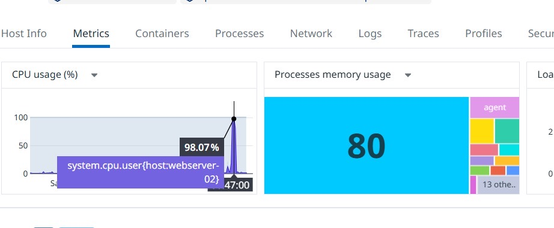

This dashboard confirms that the Datadog Agent was successfully installed and collecting live infrastructure metrics from the EC2 instance.

---

### Datadog Process Monitoring

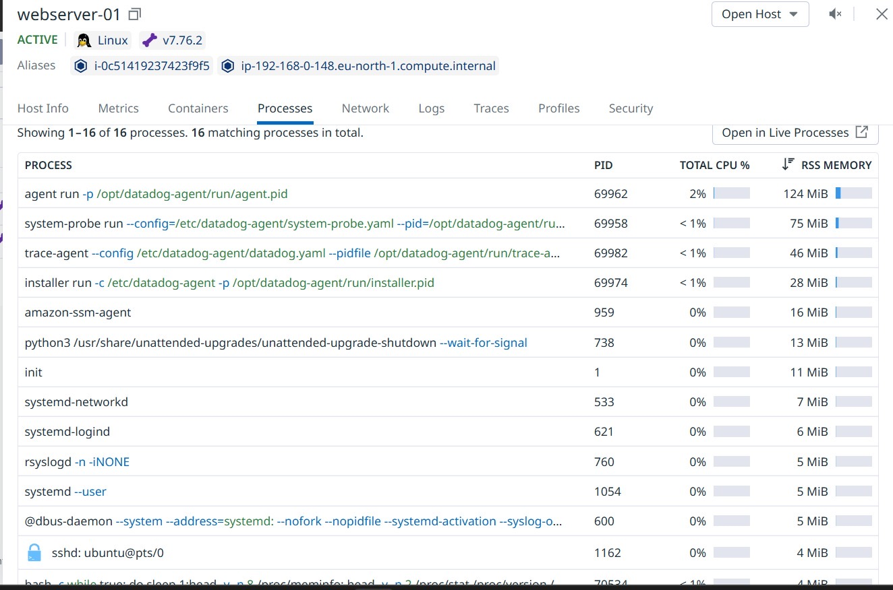

This view shows active system processes including the Datadog agent, system probe, and other core Linux services, providing deep visibility into system operations.

---

### Datadog Alert Notification

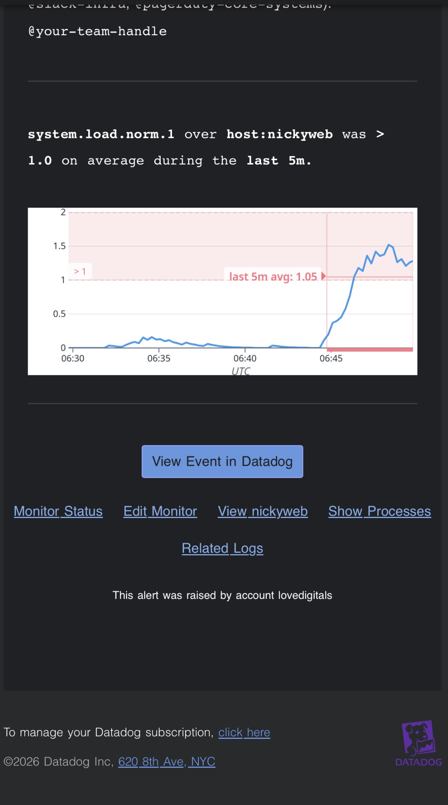

An alert was triggered when system load crossed the configured threshold.  
This demonstrates proactive infrastructure monitoring and automated incident awareness.

---

## Technical Skills Demonstrated

---

## Project Outcome

At the end of the deployment process, I successfully launched a live, secure personal portfolio website accessible via a custom domain name using HTTPS.

### Deployment Evidence

---

## Key Lessons Learned

Through this project, I gained practical experience in troubleshooting SSH connectivity issues, understanding DNS propagation delays, managing server resource limitations, and following proper deployment sequences.

I also developed confidence in configuring production-ready cloud infrastructure environments.

---

## Cost Optimization Considerations

Since the deployment was hosted on AWS infrastructure, cost-efficiency measures were considered during the project.

Key optimization strategies included:

- Using a t3.micro instance to remain within AWS free tier limits  
- Deploying a static website architecture to minimize compute overhead  
- Avoiding unnecessary managed services during initial deployment phase  
- Utilizing Elastic IP only for production stability  
- Planning future migration to CDN-based static hosting for reduced server costs  

These considerations demonstrate awareness of cloud resource management and financial efficiency in real-world deployments.

---

## Future Improvements

Future enhancements for this project include integrating Cloudflare for CDN and security protection, optimizing performance through caching and compression, adding backend services for dynamic functionality, and implementing monitoring and logging solutions.
